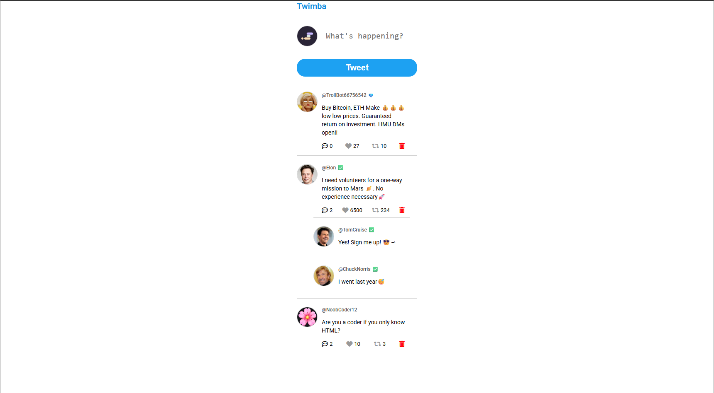

Twimba: Twitter Clone
A feature-rich social media clone that focuses on data-driven UI rendering and persistent user interactions.

🚀 Live Demo
https://benevolent-kangaroo-047b8b.netlify.app/

🛠️ Tech Stack

- HTML5 (Data attributes for event delegation)

- CSS3 (FontAwesome integration, Flexbox layout)

- Vanilla JavaScript (ES6 Modules, Array methods)

- LocalStorage (Data persistence)

🧠 Key Learnings & Features

- Event Delegation: Implemented a single event listener on the document to manage likes, retweets, replies, and deletions via data attributes.

- Data Persistence (LocalStorage): Utilized JSON.stringify and JSON.parse to ensure user interactions (likes, deletes, and new tweets) survive page refreshes.

- Array Manipulation: Mastered the use of .filter() for data retrieval and .findIndex() paired with .splice() for precise "Search and Destroy" deletion logic.

- UUID Integration: Integrated the uuid library to generate unique identifiers for every new tweet created by the user.

- Conditional Rendering: Managed CSS classes dynamically to reflect "liked" or "retweeted" states based on the underlying data model.

📸 Preview

